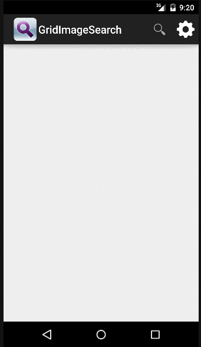

Google Grid Image Search

Hours: 7 hours.

Required Stories Completed

* [x] User can enter a search query that will display a grid of image results from the Google Image API.
* [x] User can click on "settings" which allows selection of advanced search options to filter results
* [x] User can configure advanced search filters such as
    * Size (small, medium, large, extra-large)
    * Color filter (black, blue, brown, gray, green, etc...)
    * Type (faces, photo, clip art, line art)
    * Site (espn.com)
* [x] Subsequent searches will have any filters applied to the search results
* [x] User can tap on any image in results to see the image full-screen
* [x] User can scroll down “infinitely” to continue loading more image results (up to 8 pages)

Optional Stories
* [x] Robust error handling, check if internet is available, handle error cases, network failures
* [x] Use the ActionBar SearchView or custom layout as the query box instead of an EditText
* [x] Sharing and toggle of action bar on Full Display Activity

Video Walkthrough:

GIF captured using recordIt
