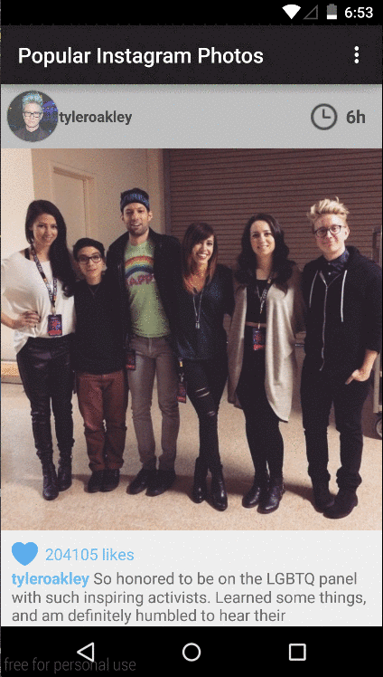

# android-instagramClient

This is a Instagram Popular Items Api Client.

Time Spent: Lost track of time but it is somewhere around 6 hours.
I would like to implement the dialog fragment to display all comments but might have to do it post submission deadline.

Completed user stories:

* [x] Required: User can scroll through current popular photos from Instagram
* [x] Required: Graphic, Caption, Username
* [x] Optional:  relative timestamp, like count, user profile image
* [x] Advanced: Add pull-to-refresh for popular stream with SwipeRefreshLayout
* [x] Advanced: Display each photo with the same style and proportions as the real Instagram. Relied on Picasso.
* [x] Advanced: Show latest comment for each photo (bonus: show last 2 comments)
* [x] Advanced: Display each user profile image using a RoundedImageView
* [x] Advanced: Display a nice default placeholder graphic for each image during loading (read more about Picasso)
* [x] Extra: Implemented Sticky Header for Instagram Style header. Used https://github.com/emilsjolander/StickyListHeaders
* [x] Extra: Styled Hashtags as well
* [x] Extra: Used ViewHolder pattern
* [x] Extra: Used RetroFit to retrieve data from the popular api on instagram.

TODO:
* [] Bonus: Allow user to view all comments for an image within a separate screen or a dialog fragment

Video Walkthrough:

GIF captured using recordIt
