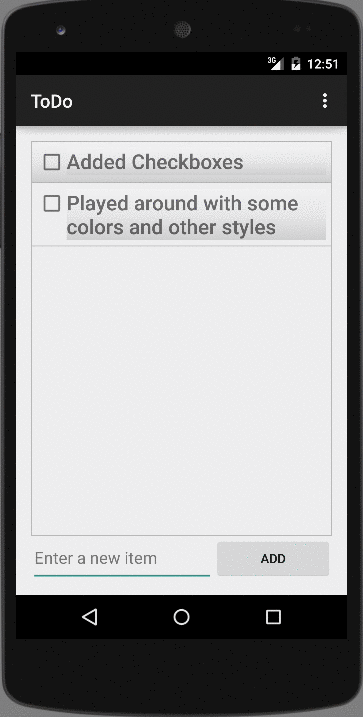
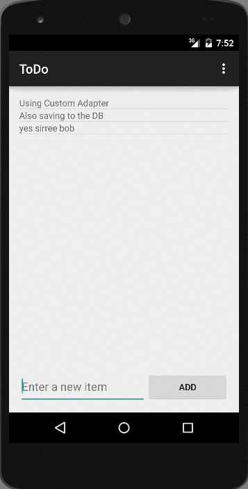
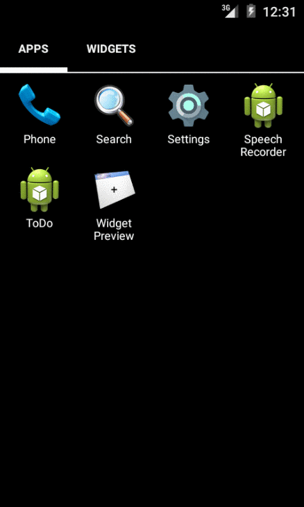
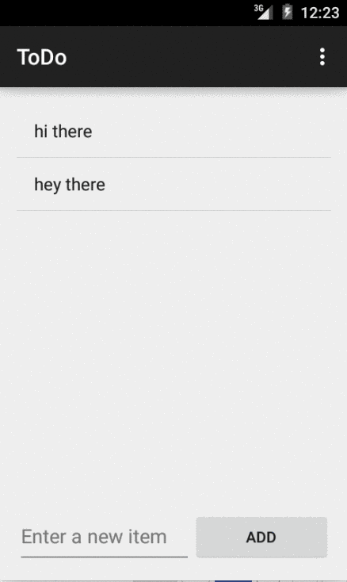

Android-SimpleToDo
==================

Prework for CodePath Android SimpleToDo

Time spent: 7 hours spent in total

Completed user stories:

* [x] Required: User can add and remove items from a list
* [x] Required: User can edit items in a list
* [x] Required: The list is persisted on file.
* [x] (Suggested) Persist the todo items into SQLite instead of a text file.
* [x] (Suggested) Used custom adapter to display TodoItem object data.
* [x] (Suggested) Tried my hand with styles using drawable. Still more to explore
* [x] (Optional) Added checkbox & strike through to mark items completed.

ToDo:
* [] Use a DialogFragment instead of new Activity for editing items
* [] Adding a due date
* [] Tweak the style improving the UI / UX, play with colors, images or backgrounds
* [] Improve performance using ViewHolder Pattern

Walkthrough of checkbox & strike through for completed tasks. Also dabbled with some styling.

Walkthrough of SQLite persistence using ActiveAndroid and CustomAdapters for display:

Previous Walkthrough GIFs

Persistence in file

Base App

GIF created with [Recordit](http://recordit.co/) as LiceCap did not work on Yosemite.

